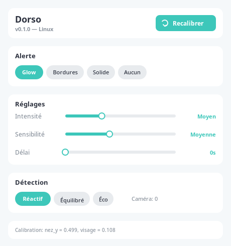
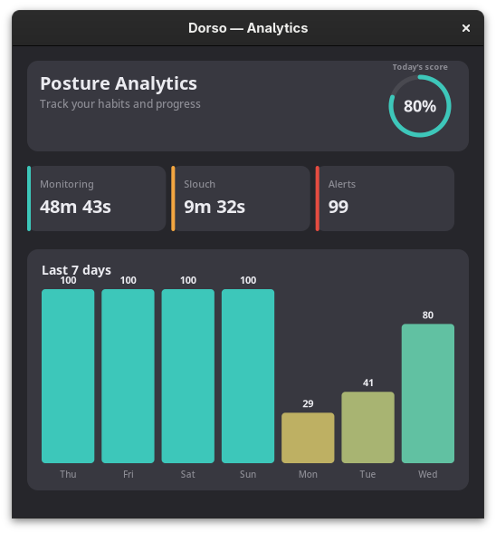

# dorso-linux

Posture monitoring tool for Linux, inspired by [dorso](https://github.com/tldev/dorso) for macOS.

Uses your webcam to detect slouching in real-time and overlays a progressive red glow on your screen as a gentle reminder to sit straight.

## Screenshots

<p align="center">
  
  
</p>

## Features

- **Real-time posture detection** via webcam (MediaPipe PoseLandmarker)
- **Progressive screen overlay** — red glow that intensifies with slouch severity
- **Click-through overlay** — keyboard and mouse work normally
- **Settings UI** — warning mode, intensity, sensitivity, detection speed
- **Analytics dashboard** — daily score, 7-day chart, monitoring time, slouch stats
- **System tray** with posture status and quick access menu
- **Dark/light theme** support (follows GNOME color scheme)
- **Auto-pause** on screen lock
- **Calibration** on first launch
- **TOML config** in `~/.config/dorso/`
- **GNOME Shell extension** — true always-on-top overlay on all monitors (GNOME Wayland)
- Works on GNOME Wayland, X11, and Layer Shell compositors (Sway, Hyprland)

## Requirements

- Python 3.11+
- Webcam
- GTK4 + PyGObject

### Fedora / RHEL

```bash
sudo dnf install gtk4-devel python3-gobject gtk4-layer-shell-devel
```

### Ubuntu / Debian

```bash
sudo apt install libgtk-4-dev python3-gi gir1.2-gtk-4.0
```

## Installation

```bash
pip install -e .
```

## Usage

```bash
python -m dorso
```

On first launch, a calibration window appears. Sit in your best posture and click **Calibrer**. Monitoring starts automatically after calibration.

When you slouch, a red glow appears on the edges of your screen. Sit straight and it fades away.

### System tray menu

The tray icon shows your current posture status (green/red/grey). Click the icon to access:

- **Status** — current posture state
- **Activer/Désactiver** — toggle monitoring
- **Recalibrer** — redo posture calibration
- **Analytiques** — open the analytics dashboard
- **Paramètres** — open settings
- **Quitter** — exit

### Autostart

To launch dorso automatically on login:

```bash
./scripts/install-autostart.sh
```

## Configuration

Settings are stored in `~/.config/dorso/config.toml`:

```toml
warning_mode = "glow"         # glow, border, solid, none
detection_mode = "responsive" # responsive (~10fps), balanced (~4fps), performance (~2fps)
intensity = 1.0               # 0.5 = gentle, 2.0 = harsh
slouch_sensitivity = 0.03     # lower = more sensitive
warning_onset_delay = 0.0     # seconds before warning appears
camera_id = 0                 # camera device index
```

## How it works

1. **Camera capture** — OpenCV grabs frames at adaptive rates (faster when slouching)
2. **Pose detection** — MediaPipe PoseLandmarker extracts nose position and face width
3. **Slouch detection** — compares nose Y to calibrated baseline with 5-frame smoothing
4. **Posture engine** — pure logic state machine with hysteresis (8 bad frames to trigger, 5 good to clear)
5. **Overlay** — GNOME Shell extension (best), Layer Shell, or transparent GTK4 window with Cairo-drawn glow
6. **Analytics** — tracks slouch events, duration, and daily scores over 90 days

## Architecture

```
Camera (OpenCV) → Detector (MediaPipe) → PostureEngine (pure logic) → Overlay (GTK4)
                                                                     → Tray (D-Bus SNI)
                                                                     → Analytics (JSON)
```

The posture engine is a pure function with no side effects — takes state + reading, returns new state + effects. Fully testable.

### GNOME Shell extension (recommended for GNOME)

For the best experience on GNOME Wayland, install the bundled extension:

```bash
./scripts/install-extension.sh
# Log out / log in
gnome-extensions enable dorso-overlay@dorso-linux
```

This gives you true always-on-top overlay on all monitors, click-through, no focus stealing, and the GNOME top bar stays visible. Without the extension, dorso falls back to a maximized GTK4 window (single monitor, windows can cover it).

## Known limitations & help wanted

### AirPods motion sensors

The macOS version supports AirPods motion sensors for posture detection. On Linux, AirPods connect as standard Bluetooth audio devices (A2DP/HFP) via BlueZ, but the motion sensor data uses Apple's proprietary AAP protocol over BLE GATT and is not accessible.

If you've done reverse-engineering work on the AAP protocol or know how to access AirPods motion data on Linux, contributions are very welcome!

## Roadmap

- [x] Overlay color picker
- [x] Custom tray icons (sitting silhouette, green/red/grey/orange/blue)
- [x] GNOME Shell extension — multi-monitor, always-on-top, click-through overlay
- [ ] AirPods motion sensor support (requires AAP protocol reverse-engineering)
- [ ] Global keyboard shortcut to toggle
- [x] Onboarding flow on first launch
- [ ] Flatpak packaging

## Tests

```bash
pip install -e ".[dev]"
pytest
```

## License

MIT
